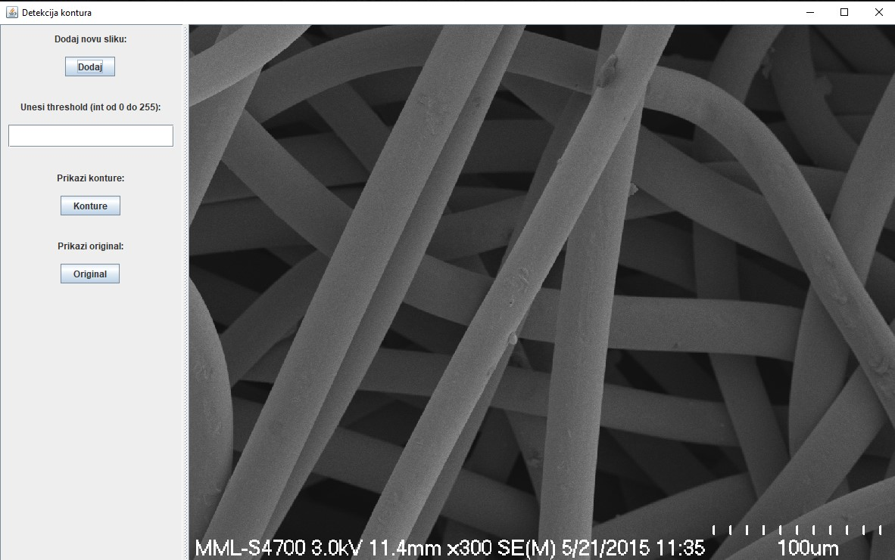
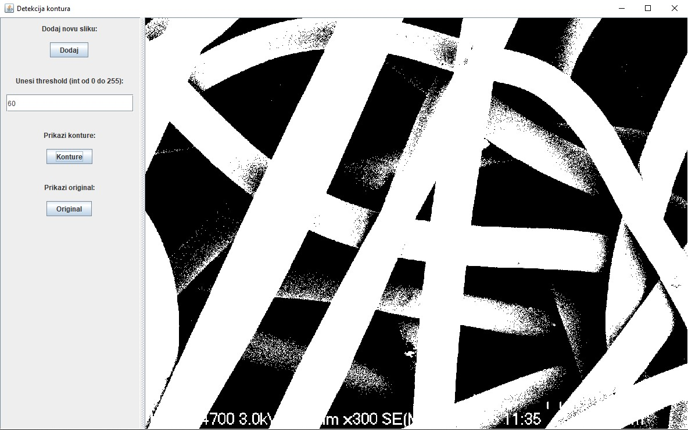

# Трешхолдинг контура

## Приказ апликације

Пројекат представља апликацију која учитава слику (у BIT map формату) и на основу унетог treshold-a препознаје контуре на слици. Апликација омогућава да корисник учита фотографију, затим унесе treshold (вредност од 0 до 255) и као решење добије слику на којој су издвојене контуре.

Приликом покретања апликације отвара се главни прозор, притиском на дугме "Dodaj" кориснику се отвара нов прозор у којем корисник проналази и додаје жељену слику.
Након учитавања слике, програм проверава да ли је слика црно-бела, уколико слика задовољава критеријум појављује се у апликацији (Слика2), уколико не задовољава програм избацује грешку и обавештава корисника да унесе валидну слику.

За унету слику, корисник у пољу "Unesi treshold" уноси жељени treshold и уколико унета вредност задовољава критеријум да је типа integer (0-255), притиском на дугме "Konture" добија слику на којој су издвојене контуре (Слика3). Да би упоредио почетну слику и слику на којој су издвојене контуре, корисник притиском на дугме "Original", враћа унету фотографију. 

